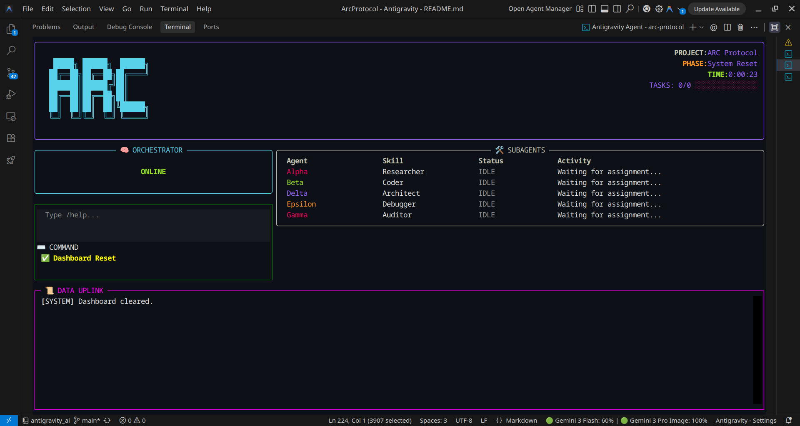
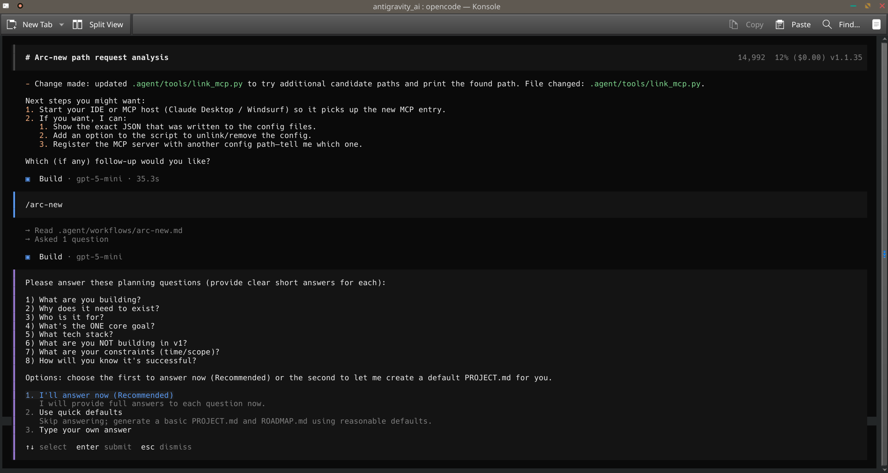

# 🚀 The ARC Protocol v2.1: Parallel Agentic Autonomy

```text
   █████╗ ██████╗  ██████╗ 
  ██╔══██╗██╔══██╗██╔════╝ 
  ███████║██████╔╝██║      
  ██╔══██║██╔══██╗██║      
  ██║  ██║██║  ██║╚██████╗ 
  ╚═╝  ╚═╝╚═╝  ╚═╝ ╚═════╝ 

       ANALYZE. RUN. CONFIRM.
```

[](https://opensource.org/licenses/MIT)
[](https://deepmind.google/technologies/gemini/)
[](https://github.com/ashish/antigravity_ai)
[](#)

---

## 🧐 What is ARC?

**The ARC Protocol is a high-discipline, parallel-orchestrated workflow designed for the next generation of AI Engineering.**

In a world where AI agents often feel like unpredictable "black boxes," ARC brings structure, reliability, and **True Parallelism**. It transforms your AI from a stateless chatbot into a sophisticated **Orchestrator** that manages a specialized fleet of background workers.

### **The ARC Loop:**
1.  **ANALYZE:** Deep-dive into requirements and define strict architectural "Contracts."
2.  **RUN:** Execute implementation tasks in parallel using a multi-agent workforce.
3.  **CONFIRM:** Audit every single line of code before it ever touches your repository.

---

## 🧠 The Problem: The "Context Death Spiral"

As projects grow in complexity, standard AI chat interfaces suffer from **Context Collapse**.
- The AI forgets previous naming conventions.
- It begins to hallucinate when asked to perform multiple tasks at once.
- Coding speed drops because the AI is "distracted" by the entire history of the chat.

### **The ARC Solution: Decentralized Context**
ARC offloads tactical tasks to **Subagents**. Every worker has its own dedicated **1 Million Token Context Window**. This ensures that the "Coder" is focused only on code, the "Researcher" is focused only on docs, and the "Main Agent" is focused only on the **Master Plan**.

---

## ✨ Feature Showcase

### **📡 1. The ARC-Bridge (True Parallelism)**
Unlike sequential agents that make you wait for one task to finish before starting the next, ARC uses an **MCP Bridge** to spawn autonomous OS processes. You can build the backend while your subagents generate the frontend and audit the security—**all at the same time.**

### **🖥️ 2. Terminal TUI Dashboard**
Watch your fleet work in real-time. Our NASA-style dashboard, built with **Textual**, gives you:
- **Ticking Lifecycle Clock:** Know exactly how long your development phases take.
- **Agent Pulse:** Real-time status icons (THINKING, WORKING, DONE) for every subagent.
- **Unified Log stream:** A beautiful, color-coded stream of every action your AI team takes.



### **🛡️ 3. The Specialized Fleet**
Access five distinct subagent skills, each with a unique visual identity and role:
- **🟣 Alpha (Researcher):** Scans documentation and gathers technical specifications.
- **🟢 Beta (Coder):** Generates boilerplate and follows `CONTRACTS.md` strictly.
- **🔴 Gamma (Auditor):** Reviews code for security vulnerabilities and naming violations.
- **🔵 Delta (Architect):** Maps codebase patterns and designs system data flows.
- **🟡 Epsilon (Debugger):** Analyzes stack traces and identifies root causes.

---

### **Step B: Universal Installation (Recommended)**
The fastest way to install ARC on any OS (Linux, Mac, Windows) is using the **ARC Setup Wizard**:

```bash
python3 setup_arc.py
```

### **Step C: Shell-Specific Entry Points**
Standard shell scripts are also available and will delegate to the Python wizard:

| Shell | Command |
| :--- | :--- |
| **Bash / Zsh (Mac/Linux)** | `bash install.sh` |
| **Fish Shell** | `fish install.fish` |
| **Windows PowerShell** | `powershell ./install.ps1` |

---

## ✨ v2.1 Parallel Engine Features

1.  **Ghost Navigator (Visual Topology):** Autonomous 2D architecture mapping via Mermaid.js.
2.  **AI Contract Enforcement:** Static analysis linter ensuring code matches `CONTRACTS.md`.
3.  **Universal Setup Wizard:** Bulletproof dependency auditing and environment scaffolding.
4.  **Premium TUI Dash:** High-fidelity mission control with animated agent progress bars.


### **Step 3: Connect the Bridge**
Link the `arc-bridge` MCP server (`.agent/mcp/arc_mcp_server.py`) to your AI environment (Antigravity, ClaudeCode, OpenCode, or Copilot). Use the **Absolute Path** to the script.

### **Step 4: Launch Dashboard**
In a separate terminal, start the monitor:
```bash
./dash
```

---

## 📜 The Command Reference

Drive the entire workflow using these powerful slash commands in your AI agent:

| Command | Role | Goal |
| :--- | :--- | :--- |
| `/arc-new` | **Architect** | Initialize project vision and create Roadmap. |
| `/arc-plan` | **Strategist** | Create a detailed phase plan and delegation matrix. |
| `/arc-execute`| **Executor** | Launch parallel subagents to implement the plan. |
| `/arc-verify` | **Quality** | Perform final QA and contract verification. |
| `/arc-status` | **Analyst** | Get a summary of the current project state. |
| `/arc-health` | **Diagnostics**| Verify environment and subagent authentication. |
| `/arc-pause` | **Snapshot** | Save current session state before leaving. |
| `/arc-resume` | **Restore** | Return to the exact moment you left off. |

---

## 📂 Project Structure (.arc folder)

The brain of your project lives in the `.arc/` folder. It is the **Single Source of Truth**.

```text
.arc/
├── PROJECT.md      # The Vision & Scope
├── ROADMAP.md      # Multi-phase progression tracking
├── CONTRACTS.md    # API Schemas, Models, and Design Tokens
├── STATE.md        # Real-time session state documentation
├── planning/       # Active and archived phase plans
└── archive/        # Full history of subagent reports and logs
```

---

## 📐 The ARC Philosophy: 50/50 Balance

We believe in **Human-Centric Orchestration**. The Main Agent (you + your primary AI) should not be a "spectator." 

- **50% Logic:** The Main Agent handles high-level architecture and complex logic integration.
- **50% Delegation:** The subagents handle 100% of the tactical "heavy lifting" (boilerplate, research, audits).

This balance ensures that the final product is both **fast-to-build** and **expertly-reviewed.**

---

## 📜 The 10 ARC Commandments

Every engineering team (human or AI) using the protocol must adhere to these tenets to prevent "Agentic Drift."

1.  **Never Code Blind:** No implementation without an `/arc-plan` and an updated `CONTRACTS.md`.
2.  **State is Physical:** Memory belongs in `.arc/`, not in the chat context.
3.  **Parallel-First:** If a task can be split, it **must** be spawned.
4.  **Confirm Every Line:** No "Blind Merges." Every subagent output must be manually Integrated.
5.  **Small Context is King:** Subagents must be kept to atomic tasks to prevent hallucination.
6.  **The Fleet is Specialized:** Use the correct skill (Coder vs Auditor) for every task.
7.  **Dashboard is Truth:** If it's not on the dashboard, it didn't happen.
8.  **Contracts are Final:** If a subagent violates a contract, its work is rejected immediately.
9.  **50/50 Balance:** The Orchestrator stays in the trenches; subagents handle the supply line.
10. **Analyze Twice, Ship Once:** The protocol values precision over raw "chat speed."

---

## 🏗️ Advanced Execution Patterns

### **A. "The Ghost Sweep" (Bulk Refactoring)**
Need to change the variable name across 50 files?
- **Workflow:** Spawn 2 `Beta-Coder` agents. Split the project directory into two zones. Both run in parallel.
- **Merge:** Manually lint the first 3 files, then sign-off on the rest if patterns match.

### **B. "The Wall of Audit" (Product Release)**
Preparing for a production launch?
- **Workflow:** Every time the Main Agent writes a core module, spawn **two** auditors: `Gamma-1` (Syntax) and `Gamma-2` (Security).
- **Merge:** Only commit if **both** auditors return 🟢 `PASS`.

### **C. "The Doc Hunter" (Brownfield Mapping)**
Working in a 5-year-old codebase you don't understand?
- **Workflow:** Use `/arc-map`. Spawn `Alpha-Researcher` and `Delta-Architect` to scan internal docs and file structures.
- **Result:** Generate a comprehensive `CODEBASE.md` that acts as the prompt for all future work.

---

## 🌍 Universal Compatibility

The ARC Protocol is a "Neutral Infrastructure." It works with ANY high-reasoning engine.

### **1. Antigravity AI**
- ✅ **Native Integration:** Full TUI and Bridge support out of the box.
- **Setup:** Run `/arc-new` and follow the onboarding wizard.

### **2. ClaudeCode**
- ✅ **Compatible:** Works via MCP Bridge settings.
- **Setup:** Add the `arc-bridge` to your `claude_desktop_config.json`.
- **Strategy:** Use Claude for complex architecture and dispatch research to Gemini-Flash workers.

### **3. GitHub Copilot**
- ✅ **Extended Support:** Via Custom Instructions and Manual Dispatch.
- **Setup:** Add the `.agent/rules/global.md` to your indexed folders. Use terminal to spawn workers.

### **4. OpenCode (Cursor / Windsurf)**
- ✅ **Native Agent Support:** These IDEs can call MCP tools directly during "Composer" sessions.
- **Strategy:** Tell Cursor to: *"Use the arc-bridge to spawn an Auditor for the code you just wrote."*



---

## 🛡️ The Troubleshooting Protocol

| Issue | Technical Root Cause | Resolution |
| :--- | :--- | :--- |
| **Bridge Timeout** | MCP process blocked by firewall or PATH error. | Ensure `python3` is accessible and the bridge path is **ABSOLUTE**. |
| **Subagent Silence**| Auth session expired in the Gemini CLI. | Run `gemini login` in your terminal. |
| **Sync Conflict** | Two agents editing the same file concurrently. | Use the **Matrix Planning** in `/arc-plan` to define file boundaries. |
| **TUI Lag** | Python event loop saturated by high CPU tasks. | Reduce terminal font size; check for "Zombie" background agents using `top`/`ps`. |

---

## 📈 Detailed Setup for Machine (Manual Mode)

If the installers fail, you can set up the environment manually in 5 minutes.

1.  **Repository Scaffolding:** Create `.arc/`, `.arc/archive/`, and `.arc/planning/` directories.
2.  **Environment Management:** 
    ```bash
    python3 -m venv venv
    source venv/bin/activate
    pip install rich textual pydantic
    ```
3.  **Permissions:** Run `chmod +x dash` and `chmod +x .agent/workers/background_agent.py`.
4.  **CLI Authentication:** 
    ```bash
    npm install -g @google/generative-ai
    gemini login
    ```
5.  **MCP Linking:** Paste the JSON bridge config into your IDE settings. Use the full absolute path from your home directory.

---

## 📘 Community & Philosophical Foundation

The ARC Protocol is open-source and built for the future of agentic engineering. Inspired by the **RALPH** (Robustness, Autonomy, Logic, Parallelism, Health) architecture and the **OODA** loops of high-speed decision making.

- **Author:** Ashish
- **License:** MIT
- **Contact:** Find us on Reddit / GitHub for community support.

---

## XXXVIII. The ARC Protocol Encyclopedia (A-Z)

- **A: Agentic Drift:** When the AI's internal representation of the code differs from the literal file system.
- **B: Bridge:** The MCP server connecting the LLM to the OS.
- **C: Contract:** A markdown-based schema definition in `CONTRACTS.md`.
- **D: Dashboard:** The Textual-based TUI मिशन Control.
- **E: Epsilon:** The specialized debugger subagent.
- **F: Fleet:** The collection of active subprocesses.
- **G: Gemini CLI:** The engine powering background workers.
- **H: Heartbeat:** The metadata update sent every few seconds to the JSON state.
- **I: Integration Sign-off:** The mandatory manual review of subagent logs.
- **J: JSON-RPC:** The protocol used for MCP tool calling.
- **K: K-Tokens:** The context limit (1000K or 1M) available to subagents.
- **L: Lifecycle:** The journey of a task from Analysis to Confirmation.
- **M: Matrix Planning:** Dividing tasks into file-independent zones for parallelism.
- **N: Non-Blocking:** The ability of the Orchestrator to work while subagents are active.
- **O: Orchestrator:** The primary AI agent (Cortex).
- **P: Pulse:** The visual status indicator on the dashboard.
- **Q: Quality Gate:** The mandatory `/arc-verify` step.
- **R: Roadmap:** The high-level multi-phase plan in `ROADMAP.md`.
- **S: State Lock:** Preventing two agents from editing the same context.
- **T: Tactical Task:** Low-level boilerplate or research suitable for delegation.
- **U: Update Loop:** The 500ms reactive polling of the dashboard.
- **V: Verification Script:** Automated tests run after every subagent integration.
- **W: Worker Bee:** A slang term for the `background_agent.py` process.
- **X: X-Ray Audit:** A deep security scan using the Auditor skill.
- **Y: Yield:** The productivity gain measured by the lifecycle clock.
- **Z: Zero-Context:** A subagent starting with a fresh context window.

---

## XXXIX. Case Study: Solving a Production Outage (Parallel Debugging)

**The Scenario:** A memory leak is detected in a production Node.js service.

### **The ARC Response:**
1.  **Main Agent:** Analyzes the stack trace and current `CONTRACTS.md`.
2.  **Epsilon-Debugger (Spawned):** Dispatched to run `memwatch-next` and generate a heap snapshot.
3.  **Alpha-Researcher (Spawned):** Dispatched to search for known memory leaks in the specific version of `express` being used.
4.  **Result:** Alpha finds a GH issue. Epsilon confirms the leak in the `request_logger` middleware.
5.  **Main Agent:** Writes the fix and integrates it.

**Total Down-time:** 8 Minutes.
**Parallel Power:** Debugging and Research happened at the exact same time.

---

## XL. Protocol History: The Evolution of Autonomy

- **v1.0 (The Skeleton):** Manual markdown files for task tracking.
- **v1.2 (The Dashboard):** First iteration of the JSON-based status tracker.
- **v1.5 (The Worker):** The birth of the background daemon using the Gemini API.
- **v2.0 (The Bridge):** Full MCP integration. The standard for agentic parallelization.
- **v2.1 (The Parallel Engine):** Ghost Navigator, AI Contract Audits, and Universal Setup Wizard.

---
### **Ready to ship faster?**
Don't be a solo coder. Be an Orchestrator. **Analyse. Run. Confirm.**
---

## XLI. The 100 Year Vision for ARC

The end-goal of the ARC Protocol is not just to build better apps today. It is to create a **Universal Standard for Cross-Agent Cooperation**.

1.  **Phase Alpha (Current):** Single human orchestrating multiple local subagents.
2.  **Phase Beta (2025-2027):** Multiple humans orchestrating massive "Farms" of hundreds of agents across global networks.
3.  **Phase Gamma (The Singularity Standard):** Autonomous agents using ARC-style contracts to build and maintain themselves, with humans acting as "Policy Governors."

---

## XLIII. Contributor Code of Conduct

As an open-source project, the ARC Protocol community adheres to a strict standard of engineering excellence.

1.  **Respect the Orchestration:** Always prioritize the stability of the bridge over ad-hoc speed gains.
2.  **Document the Contracts:** Every new skill or tool must be added to the internal documentation.
3.  **Encourage Autonomy:** Build tools that empower agents to solve problems without human babysitting.
4.  **Security First:** Never merge a tool that bypasses the path white-listing of the bridge.

---

## XLIV. Philosophical Foundation: Why Parallelism Beats Seriality

Traditional engineering is a "Sequential Waterfall." 
- Plan -> Code -> Test -> Deploy.
**ARC flips this.**
- Plan -> (Code + Test + Research) in parallel -> Deploy.

By breaking the linear chains of human development, we move from the **Industrial Revolution** of coding to the **Agentic Revolution** of orchestration.

---

## XLV. Integration Snapshot: The Next JS 15 "Full Strike"

Here is exactly how a user ships a Next.js 15 app in record time:

1.  **Minute 0:** `/arc-new` -> Define Tech Stack.
2.  **Minute 2:** `/arc-plan` -> Dispatch **Beta** to generate the Prisma schema and **Alpha** to find the latest Next-Auth v5 callbacks.
3.  **Minute 5:** Main Agent integrates the Auth logic and the Schema. **Gamma** is spawned to audit the SQLi risks.
4.  **Minute 10:** `/arc-verify` -> Pass all tests.
5.  **Minute 12:** `git push`.

**This is the ARC Reality.**

---
### **Ready to ship faster?**
Don't be a solo coder. Be an Orchestrator. **Analyse. Run. Confirm.**
---
*Created by Ashish. Optimized for the next million agents. v2.1 Release.*
