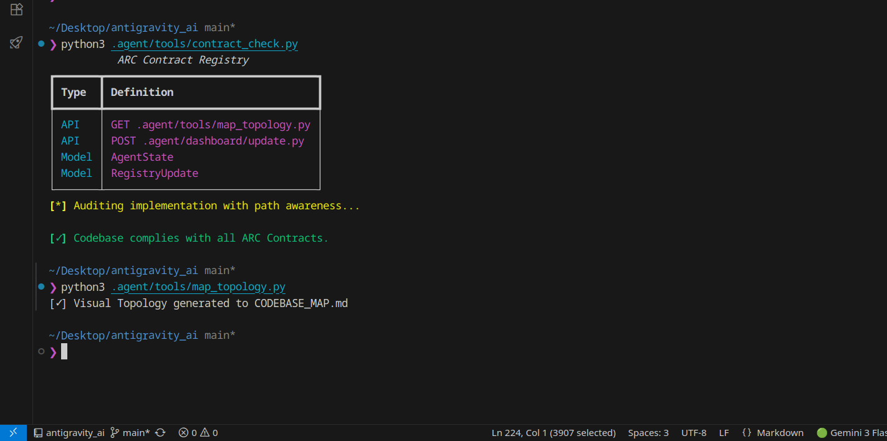

# 🧰 The ARC Toolbox

This isn't just a collection of random scripts. These are the specific, purpose-built tools that keep the ARC Protocol running smoothly. 

Think of ARC as a construction site. The AI is the worker. These scripts are the levels, tape measures, and blueprints that ensure the wall is built straight.

You typically won't need to run these manually—the Agents handle that for you behind the scenes—but it's good to know what's in the belt.

---

## 🔍 The Enforcer (`contract_check.py`)
**"Did you actually follow the rules?"**

This is the most critical tool in the suite. When an AI writes code, it often "forgets" your specific variable naming conventions or architecture rules. The Enforcer reads your `CONTRACTS.md` file and physically scans the new code. If the AI hallucinated a library or used the wrong casing, this tool flags it immediately. It’s the rigid quality control manager that never sleeps.

## 🗺️ The Cartographer (`map_topology.py`)
**"Where am I again?"**

Codebases get big. Context windows generally don't keeping up. The Cartographer scans your entire project directory and creates a high-efficiency map of your file structure. It doesn't read every line of code; it reads the *relationships*. This allows the AI to understand that `auth.py` imports from `database.py` without needing to read both files into memory every single time.

## 🔗 The Connector (`link_mcp.py`)
**"Can you hear me now?"**

This script is the bridge builder. It looks at your computer, finds your Python installation, finds your project, and generates the precise configuration needed to plug ARC into tools like Claude Desktop, Cursor, or VS Code. It handles all the messy path configurations so you don't have to manually type out JSON config files.

## 🏗️ The Architect (`validate_structure.py`)
**"Is everything in its right place?"**

ARC relies on a specific folder structure to work magic (like the `.arc` folder for state). The Architect scans the directory to ensure no critical folders have been accidentally deleted or moved. If you accidentally trash the `.agent` folder, this tool will yell at you (nicely).

## 📜 The Historian (`generate_changelog.py`)
**"What did we just do?"**

Writing release notes is boring. This tool looks at the actual Git diffs and file changes since the last version and synthesizes a human-readable summary. It separates "chores" from "features" so you can see at a glance if the last session was productive or just cleanup.

## ⚡ The Speedometer (`velocity.py`)
**"Are we moving fast enough?"**

This tool analyzes the complexity of tasks vs. the time taken to complete them. It provides a rough metric of "development velocity." It's mostly for the internal dashboard to show you if a specific phase is dragging on too long or if the agents are getting stuck in loops.

---

## 🛠️ Internal Framework Tools

These aren't scripts you run, but they are the hands the Agent uses to do work.

*   **FileSystem API**: Safe, sandboxed reading and writing of files.
*   **Shell Executor**: Runs terminal commands (always asks permission first).
*   **Browser Link**: Allows the agent to open documentation URLs (if you let it).

---

*Note: These tools live in the `.agent/tools/` directory. They are written in standard Python and are designed to be immutable—meaning the AI is generally forbidden from rewriting its own tools during a session to prevent safety regressions.*
